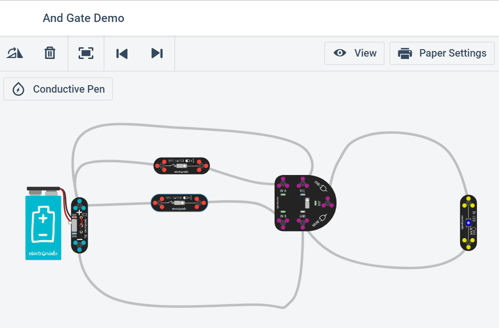
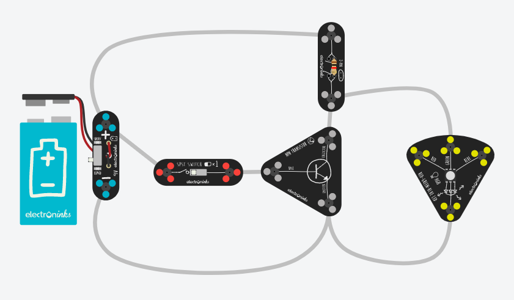

## 硬件编程--电路与二进制运算

&emsp;&emsp;电路是计算机实现的基础。目前，不管什么语言编写的程序都是通过计算机自己翻译成机器语言，由电路执行。

### 实验目的

* 了解基本门电路
* 理解布尔代数、逻辑符号与电路之间关系
* 用门电路，实现简单的计算和存储功能

### 实验/学习工具

在线电路设计和仿真工具 Circuit。

> AutoDesk Circuits https://circuits.io/

**！该工具是中学生电路入门工具，功能有限！但直观，易用**

与门案例：

### 实验步骤

**操作入门**

1. https://circuits.io/ 登陆并注册账号
2. 点 “+New” 选择 “Circuitscribe” 电路图就创建了。
3. 创出上图与门案例：
    * “+ Modeles” 添加元器件
    * Rotate 符号旋转器件
    * "Conductive Pen" 用于画导线
4. 仿真
    * 按 “Start Simulation” ，电池会自动接上
    * 点击开关
5. 画真值表验证与门功能

| In A | IN B | Out |
|:-:|:-:|:-:|
| 0 | 0 | 0 |
| 0 | 1 | 0 |
| 1 | 0 | 0 |
| 1 | 1 | 1 |

* 上表中：1 表示与门器件引脚对应小 LED 亮，0 表示不亮

**电路连接（导线交叉问题）**

1. 电源线（现实中是红色），用它连接电源的“+” 和 器件的 “VCC”。 有 “VCC” 引脚的器件必须接电源
2. 地线（现实中是蓝色），用它连接电源的“-” 和 器件的 “END”。 有 “END” 引脚的器件必须接地线
3. 由于模拟软件中，导线相交意味着联通，因此可能导致器件不正常。
4. 一种方法是利用电阻引脚之间的空间（如下图），实现导线交叉，但要注意：
    * 电阻有属性，**电阻值取100偶（最小值）**
    * 电阻不能串联在电源线、地线上
    * 近可能少用电阻，实现导线交叉

**任务 1：建立一个简单电路**

（1）建立非门功能(O = A')验证电路：

由于软件没有提供 “NOT GATE”， 你可以通过三极管和电阻自己搭建，如下图：

* 电阻选 1K 或 10K 欧姆？
* 用一个开关控制输入，LED 表示输出？

*注：用截图工具截图，务必存 png 格式*

（2）填写表格：

|INPUT(toggle switch)|OUTPUT(led)     |
|:--:|:----:|
|ON(1)               |?(?)            |
|OFF(0)              |Red(1)          |

（3）选做题：

* 如何用 XOR 门作非门。
* 串联、并联三极管，结果是什么门？

**任务 2：验证电路等价**

（1）分别建立电路 A（B+C）和 AB+AC 在一个界面上。

用 A，B，C 用三个开关控制输入，用两个 LED 表示输出。

*注：用截图工具截图，务必存 png 格式*

（2）并枚举所有可能输入，用真值表记录结果。

| A | B | C | O1 | O2 |
|:-:| :-:|:-:|:-:|:-:|
| 0 | 0 | 0 | ？ | ？ |
| 0 | 0 | 1 | ？ | ？ |

**任务 3：理解存储电路**

（1）按课件 S-R latch 搭建电路：

*注： 与非门 = 一个与门的输出连接非门的输入*

（2）顺序按Set，Reset，并填写以下表格

| ~Set  | ~Reset |Q（X）  |~Q（Y） |
|:-:|:-:|:-:|:-:|
|1     |1     |0     |1     |
|0     |1     |  &emsp;    |  &emsp;    |
|1     |1     |   &emsp;   |  &emsp;    |
|1     |0     |  &emsp;    |   &emsp;   |
|1     |1     |  &emsp;    |  &emsp;    |

**任务 4：设计全加电路**

（1） 画出一位的全加电路
（2） 画出二位的全加电路

*注：用截图工具截图，务必存 png 格式*

### 任务要求

请以个人实践为背景，用自己的语言，写一篇技术博客，博客名称类似：

* “**我的电路实践**”  
* “**加法电路原理**”  
* ...

### 评价标准

- [x] 5分：四个任务，电路搭建正确，结果正确
- [x] 4分：四个任务，基本正确
- [x] 3分：少于四个任务
- [ ] **0分：盗图**
