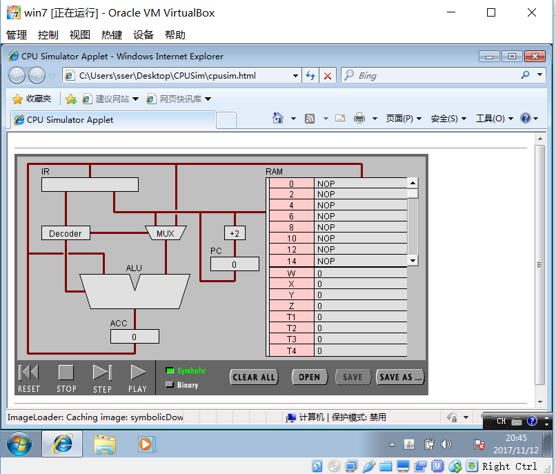

## 硬件编程--机器指令编程

&emsp;&emsp; 利用机器指令控制冯诺依曼计算机执行程序。

### 一、实验目的

* 理解冯·诺伊曼计算机的结构
* 理解机器指令的构成
* 理解机器指令执行周期
* 用汇编编写简单程序

### 二、实验/学习工具

简单 CPU 仿真工具 Pippin CPUSim ！

**实验环境环境**

* windows 7 或 **以下**
* 浏览器 IE 8 或 **以下**
* Java Runtime Environment 1.6（JRE 6.0）或 **以下**

**网址**

* http://www.science.smith.edu/~jcardell/Courses/CSC103/CPUsim/cpusim.html

*如果你的设备不符合以上要求，则需要安装虚拟机*

### 三、实验步骤

启动 win 7 虚拟机, 我们看到桌面上有两个 IE 图标 ：`CPUSIM` 和 `The Pippin Guard!` 

*运行 cpusim 会出现如下提示*

选择允许阻止内容，看到如图内容就成功了！

**任务 1：简单程序**

（1）打开网页 The PIPPIN User's Guide ，然后输入 Program 1：Add 2 number

（2）点step after step。观察并回答下面问题：

1. PC，IR 寄存器的作用。
2. ACC 寄存器的全称与作用。
3. 用“LOD #3”指令的执行过程，解释Fetch-Execute周期。
4. 用“ADD W” 指令的执行过程，解释Fetch-Execute周期。
5. “LOD #3” 与 “ADD W” 指令的执行在Fetch-Execute周期级别，有什么不同。

（3）点击“Binary”,观察回答下面问题
	
1. 写出指令 "LOD #7" 的二进制形式，按指令结构，解释每部分的含义。
2. 解释 RAM 的地址。
3. 该机器CPU是几位的？（按累加器的位数）
4. 写出该程序对应的 C语言表达。
	
	
**任务 2：简单循环**

（1） 输入程序Program 2，运行并回答问题：

1. 用一句话总结程序的功能
2. 写出对应的 c 语言程序
	
（2） 修改该程序，用机器语言实现 10+9+8+..1 ，输出结果存放于内存 Y

1. 写出 c 语言的计算过程
2. 写出机器语言的计算过程
3. 用自己的语言，简单总结高级语言与机器语言的区别与联系。

### 四、任务要求

请按任务1、2 要求，按次序回答问题。

实验提交方式：学号-姓名-汇编实验报告.pdf 到 matrix

实验报告是正式的文档，请满足以下需求：

1. 有封面，包括实验名称、学号、姓名
2. 目录页
3. 实验目标
4. 实验步骤与结果 （屏幕截图，务必用 png 格式嵌入 word，再转pdf）
5. 实验小结（必须回应实验目标达成情况）

### 五、附加实验

如果你对 CPU 的指令与执行特别有兴趣， 以下地址讲述了微代码（microcode-based）的  CPU，它已比较接近现代的 CPU 控制技术！

http://www.mathematik.uni-marburg.de/~thormae/lectures/ti1/code/cpusim/

做一些网页提供的案例，编一些简短的程序。它与前面的 CPU 有哪些不同？
例如： 寄存器、指令格式、指令周期 ... 
