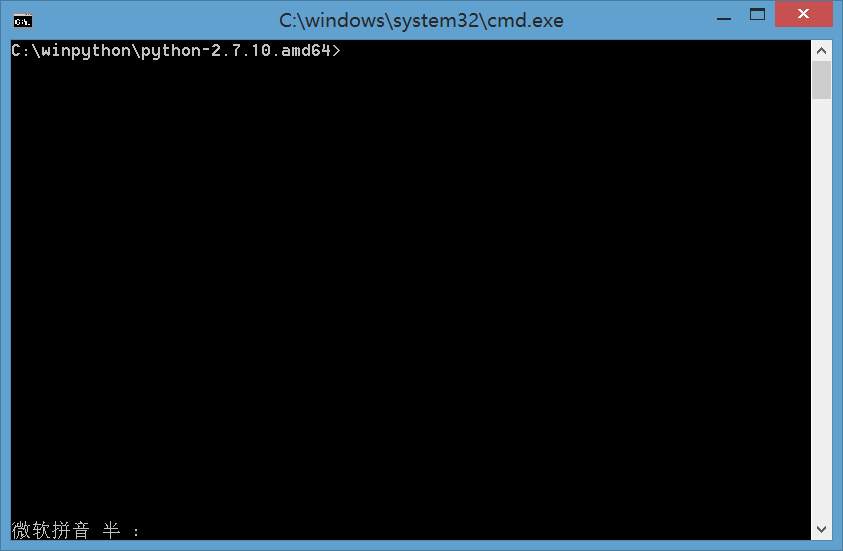
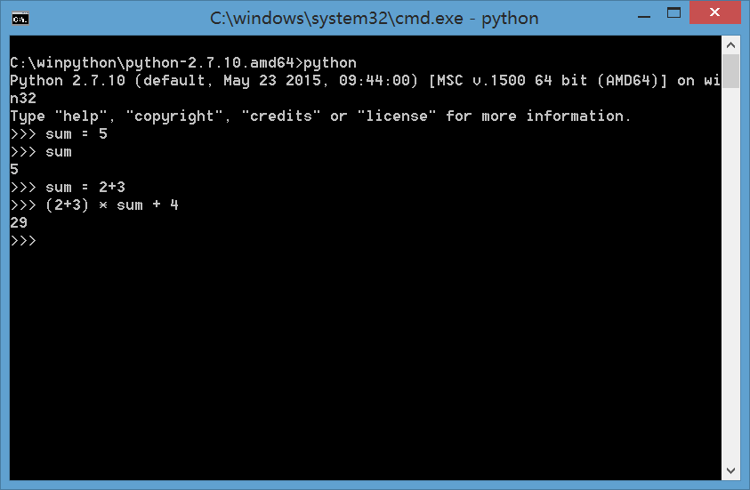
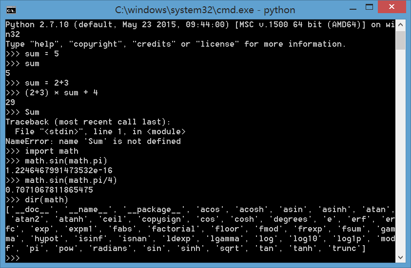

## 用 python 做计算器，做数学题 

计算机语言是我们指挥计算机干活的工具！

计算机高级语言总体分两大类:

* “编译型”语言，即程序写好后，使用编译器编译出机器可执行的代码， 例如 C，C++
* “解释型”的语言，即程序一边解释一边执行。
	
“解释型”语言多数可以实现交互式编程，什么是交互式编程？它有什么好处？

### 一、实验目的

1. 了解一种“解释型”语言 python
2. 使用 python 做一些简单的科学计算

### 二、实验环境 

* 编程工具：Python（winpython / Anaconda）
* 操作系统：Windows (only)

_注:建议使用 Anaconda ，但是以下内容没有被测试。_

**环境准备**

（1）安装winpython

尽管python有很多发行版本，作业使用winpython。它是windows环境下最易于使用、最强大的科学计算工具之一。

下载网站“ https://sourceforge.net/projects/winpython/files/ ” 下载提供的最新版本，并安装！例如：WinPython-64bit-3.6.3.0Qt5.exe (409.0 MB)

_如果你使用 Anaconda， ！对这是多数师兄师姐使用的大数据处理工具_

下载网站：https://mirror.tuna.tsinghua.edu.cn/help/anaconda/ 校园网内够快！

（2）准备使用python

winPython 提供了许多启动方法，最基本的方法是运行安装目录（例如： C:\winpython）下的 WinPython Command Prompt.exe 。 

你会看到一个命令行窗口。



输入命令：`python`  <CR>

你就见到 python 的命令提示符: `>>>`


在>>>符号提示下，输入函数 quit() 

可退出python！

继续输入 python 启动 python 之旅。

### 三、使用 python 作为计算器

**3.1 使用简单表达式**

输入一个表达式，计算结果立马就出来了。例如： 

```
>>> 2+3
5
```

你就看到结果 5

存储变量，例如：

```
>>>sum = 2+3
>>>sum
```

你就看到sum中存储了5。你不需要定义类型，这个一个万能的房子，可以装任何你喜欢的数据。
 


你可以尝试sum = 2.3 + 7

注意：python和c一样，变量名是大小写敏感的。


**3.2 使用数学函数** 

例如：

	>>> import math
	>>> math.sin(math.pi/4)
	>>> 0.70716…

import math 表示使用一个函数包（库）math，这个库有常用的数学函数，例如 sin，常数  pi 和 e 等。
使用时使用“库名.函数”与“库名.变量”。

这时，你可能问这个库有哪些函数和变量? 使用 dir 函数
	
	>>> dir(math)


	
函数如何使用呢？使用help 函数

	>>> help(math.sin)
	
或者

	>>>help(math)
 

 
python 是拥有世界上最庞大的函数库（程序库）的语言。这归功于 Python 是最早开源的项目，众多大学非计算机/计算机专业使用 python 作为科学计算工具。得益于开放和巨大且日益增长的程序库，今天从数学函数、到web编程、网络分析、数据挖掘、机器学习、生物信息处理、图形图像、大数据处理等等，python 都是最重要、最方便的开发语言。


### 四、使用Python做高数题目

python 拥有庞大数学计算工具库，不说线性代数、概率论等计算问题，即使高等数学一些函数分解等也会做。

**4.1 高数工具**

Python有一个神奇的函数库叫 SymPy 的符号库。至今，它的版本也是0.7，但已经很有用了。

已有人写了非常好的教程让我们体验这个函数库的魅力！

	https://github.com/sympy/sympy/wiki/Quick-examples

第一部分是基本符号操作，如定义符号。在确保变量名不冲突情况下，可以使用

	>>>form sympy import *

导入库中所有函数和常量、变量

**阅读要求** ：至少会解一元方程、泰勒分解等作业。

如果你有更多兴趣去探索这个库的能力，这个链接（官方网站的资料当然全面，但不是好教程）是有价值的。

	http://docs.sympy.org/latest/tutorial/index.html

注意：请不必百度，几乎没有有价值的入门文档。

**4.2 线性代数工具**

Numpy 是向量计算的基础库，几乎所有科学计算程序库都依赖（建立在）这个库之上。这个库内容太多太多，即使入门教程也很长很长。

	http://docs.scipy.org/doc/numpy-dev/user/quickstart.html

好在我们的要求不高，看看Linear Algebra 部分就可以了。请别认为这个库不强大，除了证明题，所有线性代数作业都是几个命令的事情。

**下一步学习**

如果做了前面的内容你可能已被吸引了，觉得c语言真的是废材! 不。。。不是的。。。python 基础库几乎都是 c 写的，学好 c 最重要。

如果你对python科学计算感兴趣，有国人为非计算机专业人士写了一本教程，非常合适科学计算入门。感谢作者！

《*用Python做科学计算*》（http://old.sebug.net/paper/books/scipydoc/index.html ）

这本书使用的python发行版是python(x,y) ，但 python(x,y) 的原作者现在玩 winpython 了。所以只能保证大多数程序可以在 winpython 上正确运行。

如果你对 python 编程更感兴趣，python官方的学习资料是不错的。

	https://docs.python.org/3.4/tutorial/

必须承认，这个学习资料是枯燥无味的玩意，但能满足你各种各样的编程需要，对有程序基础的人也算友好把。

### 五、实验报告要求

使用python求解

1. 选择2个高等数学上的作业，如泰勒分解、公式化简、解方程等。 （一般搜索不到有价值的答案）
2. 选择2个线性代数上的作业，如求dot、逆矩阵等，最好会解方程。（建议阅读《用Python做科学计算》）


